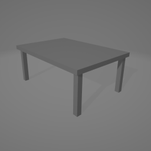

# Models-OBJ

## Spis treści
- [Opis](#opis)
- [Modele](#zrzuty-ekranu)
- [Technologie](#technologie)
- [Licencja](#licencja)

## Opis
**Models-OBJ** to zbiór modeli wytworzonych w aplikacji Blender

## Modele

## Technologie
Modele stworzono w aplikacji Blender 4.5.
  
## Licencja
Licencja Otwarta – Uznanie autorstwa  
  
Ten program może być:  
-Pobierany  
-Kopiowany  
-Modyfikowany  
-Wykorzystywany w projektach prywatnych i komercyjnych  
  
Pod warunkiem, że:  
-Zachowana zostanie informacja o autorze oryginalnego programu  
-Podane zostanie źródło (link do repozytorium)  
-W przypadku modyfikacji, należy wyraźnie zaznaczyć, że program został zmodyfikowany oraz przez kogo.  